<div align="center">


<h1>Vault Central Management</h1>

<p><strong>The Institutional-Grade Platform for Standardized Secrets Foundations, Policy-as-Code Governance, and Multi-Cloud Security Ecosystems.</strong></p>

[]()
[]()
[]()

<br/>

> **"Industrializing secrets management to automate security foundations."** 
> **Vault Central Management** is an enterprise-grade platform designed to provide a secure, measurable, and highly automated foundation for global security operations. It orchestrates the complex lifecycle of secrets—from automated credential rotation and multi-cloud policy reconciliation to high-throughput encryption intelligence and unified security auditing.

</div>

---

## 🏛️ Executive Summary

Hardcoded credentials and fragmented secrets management are strategic operational liabilities; lack of a standardized secrets framework is a primary barrier to organizational engineering maturity. Organizations fail to secure their data not because of a lack of encryption, but because of fragmented evaluation standards, lack of automated credential reconciliation, and an inability to orchestrate security planes with operational precision.

This platform provides the **Secrets Automation Plane**. It implements a complete **Vault-Central-Management-as-Code Framework**, enabling CISO teams and Security Architects to manage global security foundations as first-class citizens. By automating the identification of policy regressions through real-time telemetry analysis and orchestrating the provisioning of secure performance-driven security policies, we ensure that every organizational workload—from core application databases to edge serverless functions—is secured by default, audited for history, and strictly aligned with institutional security frameworks.

---

## 📐 Architecture Storytelling: Principal Reference Models

### 1. Principal Architecture: Global Zero-Trust Secrets Plane & Intelligence Plane
This diagram illustrates the high-level relationship between the Identity & Access layer, the Vault Central Intelligence Plane, and the underlying Enterprise Vault Cluster. It defines the bridge between human/machine identities and the secure secrets substrate.

```mermaid
flowchart LR
    %% Subgraph Definitions
    subgraph Identity["Identity & Access (Zero Trust)"]
        direction TB
        OIDC["OIDC / Okta / Azure AD"]
        K8sAuth["Kubernetes Auth Method"]
        Token["AppRole / Vault Tokens"]
    end

    subgraph IntelligencePlane["Vault Central Intelligence Plane"]
        direction TB
        API["FastAPI Management Gateway"]
        Policy["Policy Engine (Sentinel)"]
        Namespace["Namespace Manager"]
        Audit["Audit & Compliance Hub"]
    end

    subgraph CoreVault["Enterprise Vault Cluster"]
        direction TB
        KV["KV Secrets Engine"]
        Transit["Transit Encryption"]
        PKI["Dynamic PKI Engine"]
        DBMethod["Dynamic Database Secrets"]
    end

    subgraph Connectivity["Secure Connectivity & Edge"]
        direction TB
        LB["Load Balancer / Ingress"]
        PE["Private Endpoints"]
        Seal["Auto-Unseal (KMS/HSM)"]
    end

    subgraph TargetApps["Consumer Workloads"]
        direction TB
        Sidecar["Vault Sidecar Agent"]
        CSI["Secrets Store CSI"]
        CICD["CI/CD Runners"]
    end

    subgraph DevOps["DevOps & Governance"]
        direction TB
        GH["GitHub Actions"]
        TF["Terraform Vault Provider"]
        Monitor["Prometheus / Grafana"]
    end

    %% Flow Arrows
    Users((Security Admins)) -->|1. Authenticate| OIDC
    OIDC -->|2. Issue Token| API
    API -->|3. Configure| Namespace
    Namespace -->|4. Apply Policy| Policy
    
    GH -->|5. Provision| TF
    TF -->|6. Manage| CoreVault
    
    TargetApps -->|7. Auth| K8sAuth
    K8sAuth -->|8. Verify| CoreVault
    CoreVault -->|9. Inject| Sidecar
    Sidecar -->|10. Consume| TargetApps
    
    CoreVault -->|Telemetery| Monitor
    Monitor -->|Visualize| Dash
    CoreVault -->|Audit Logs| Audit
    Seal -->|Unseal| CoreVault

    %% Styling
    classDef identity fill:#e1f5fe,stroke:#01579b,stroke-width:2px;
    classDef intel fill:#ede7f6,stroke:#311b92,stroke-width:2px;
    classDef core fill:#e8f5e9,stroke:#1b5e20,stroke-width:2px;
    classDef connect fill:#fff3e0,stroke:#e65100,stroke-width:2px;
    classDef target fill:#f5f5f5,stroke:#616161,stroke-width:2px;
    classDef devops fill:#fffde7,stroke:#f57f17,stroke-width:2px;

    class Identity identity;
    class IntelligencePlane intel;
    class CoreVault core;
    class Connectivity connect;
    class TargetApps target;
    class DevOps devops;
```

### 2. The Secrets Lifecycle Flow (Rotation & Injection)
The continuous path of a managed credential from initial generation and target system update to secure injection via sidecars and automated lease reconciliation. This ensures zero-interruption operations through dependency-aware secret lifecycles.

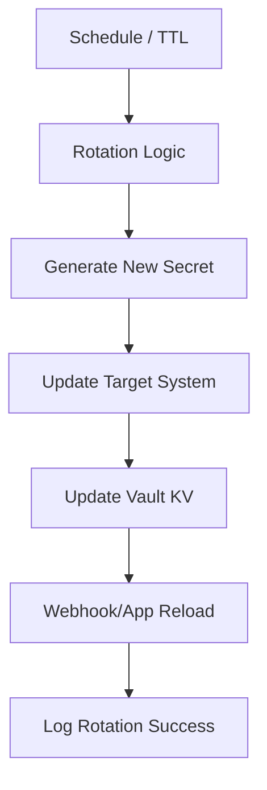

**Secret Injection Lifecycle:**
```mermaid
flowchart LR
    subgraph Pod["Kubernetes Pod"]
        App["Main Application"]
        Agent["Vault Agent Sidecar"]
    end

    subgraph Server["Vault Cluster"]
        KV["KV Secrets"]
    end

    Agent -->|1. Auth| Server
    Server -->|2. Token| Agent
    Agent -->|3. Fetch| KV
    KV -->|4. Secret| Agent
    Agent -->|5. Render| File[/vault/secrets/config]
    App -->|6. Read| File
```

**Dynamic Secrets Flow:**
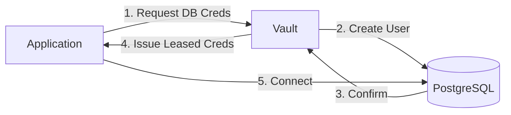

**Dynamic PKI Certificate Flow:**
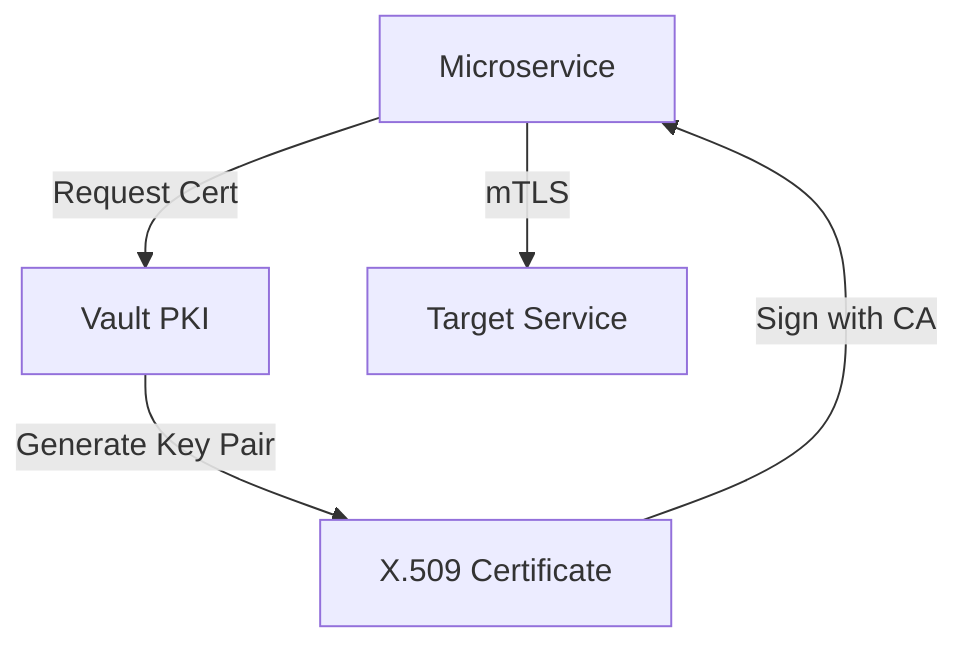

### 3. Distributed Secrets Topology (Namespaces & Replication)
Strategically orchestrating standardized secret namespaces across global regions and diverse resource architectures, providing a unified institutional view of secrets isolation.

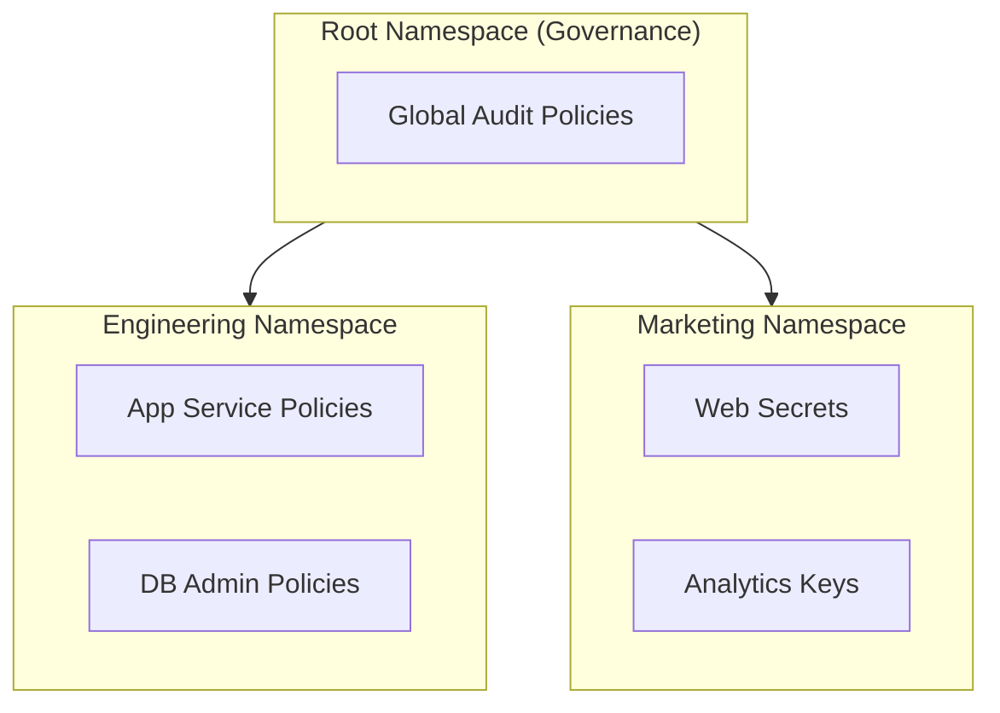

**Cluster Replication Topology:**
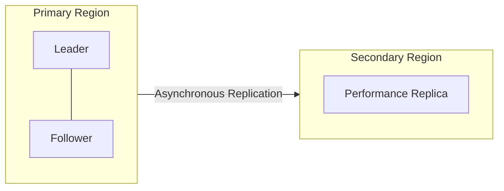

### 4. Governance Hub & Control Plane Flow
Executing complex logic for securing the bridge between identities and secrets, ensuring every request is authorized via Sentinel, leases are tracked, and executive oversight is maintained.

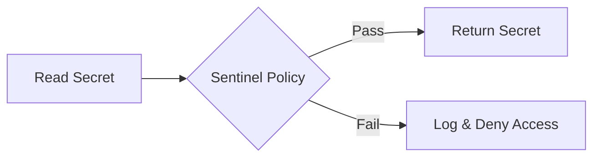

**Lease Management Flow:**
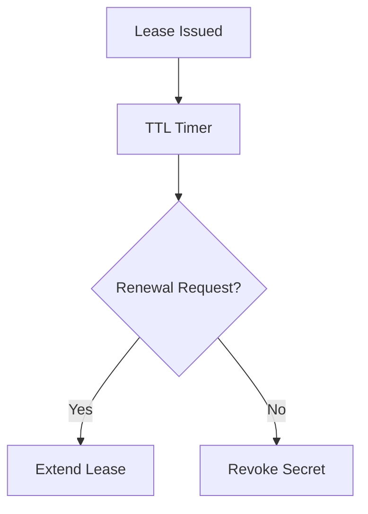

### 5. Multi-Cloud Secrets Federation (Performance Replication)
Automatically managing unified secrets standards across global regions and diverse cloud tenants, ensuring institutional data residency and privacy boundaries by default.

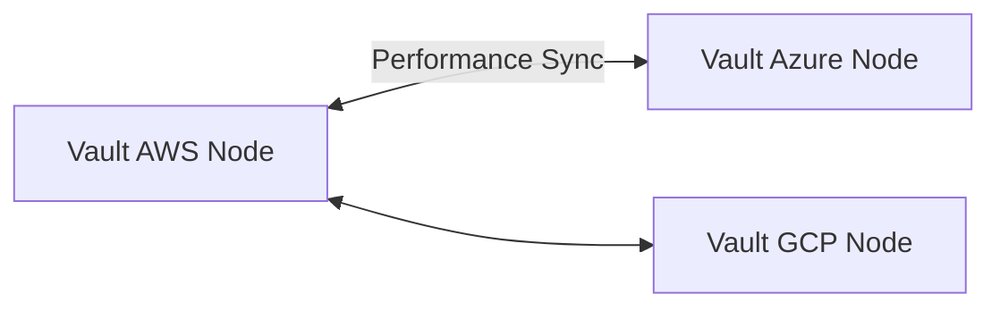

### 6. Encryption & Perimeter Protection Flow (Seal/Unseal)
Managing the lifecycle of a vault barrier, automatically enforcing institutional KMS auto-unseal and encryption standards as required by security policy, ensuring zero-latency security confidence.

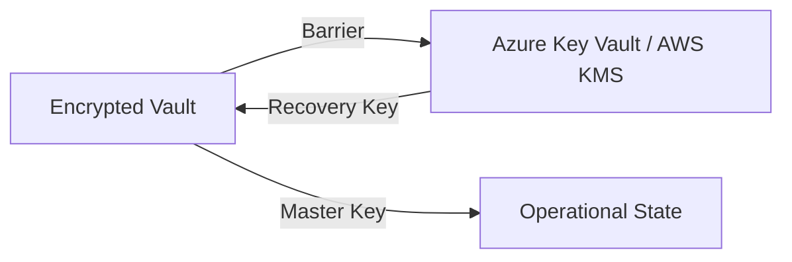

**Transit Encryption as a Service:**
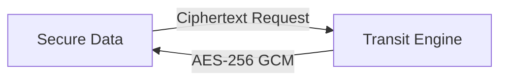

### 7. Institutional Secrets Maturity Scorecard (Audit Reporting)
Grading organizational performance based on key indicators: Rotation Success Index, Policy Compliance Index, and Zero-Trust Adoption Scores.

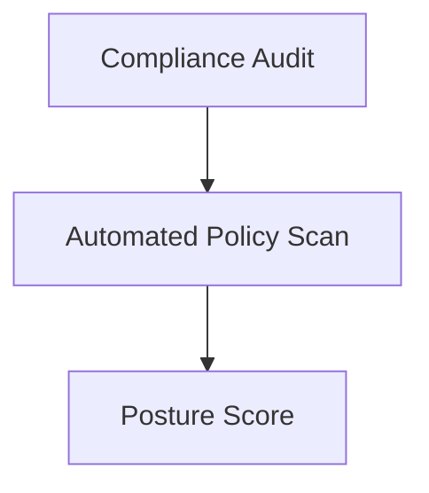

### 8. Identity & RBAC for Secrets Governance
Managing fine-grained access to secrets hubs, provisioning workers, and audit logs between Security Admins and Application Identites.

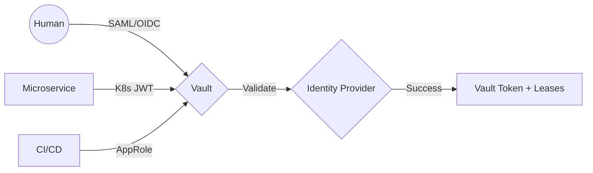

**Policy-as-Code Mapping:**
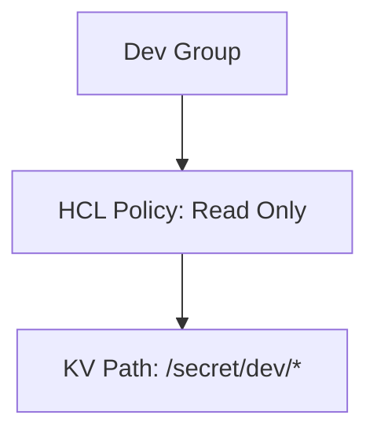

### 9. IaC Deployment: Vault-Central-Management-as-Code Framework
Using modular Terraform pipelines to deploy and manage the versioned distribution of the vault clusters, seal mechanisms, and validation fleets.

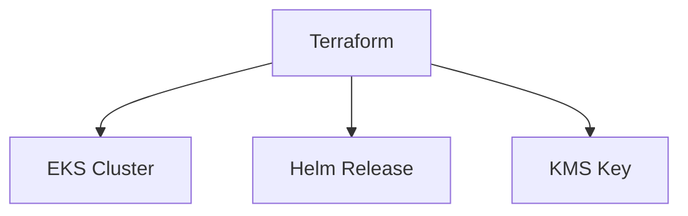

### 10. AIOps Secrets Drift & Risk Validation Flow
Using advanced analytics to identify sudden surges in access failures, unauthorized policy changes, or unusual delivery pattern changes that could result in institutional risk or audit failure.

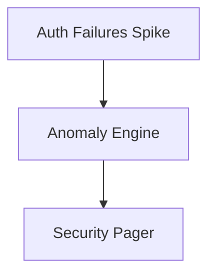

**Secret Usage Entropy:**
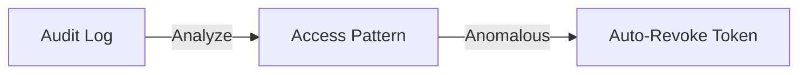

### 11. Metadata Lake for Forensic Secrets Audit
Storing long-term records of every secret integration event (metadata), every credential rotation executed, and every audit stream for institutional record-keeping and forensic analysis.

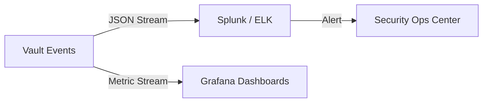

**Immutable Audit Vaulting:**
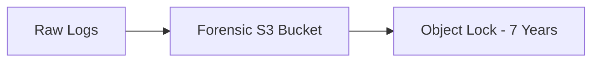

---

## 🏛️ Core Governance Pillars

1.  **Unified Foundation Coordination**: Maximizing resilience by centralizing all security measurement through a single institutional plane.
2.  **Automated Secret Provisioning**: Eliminating "manual tracking" scenarios through proactive orchestration and pattern verification.
3.  **Sequential Secrets Intelligence**: Ensuring zero-interruption operations through dependency-aware rotation-driven data engineering.
4.  **Zero-Trust Identity Protection**: Automatically enforcing identity-based access, KMS encryption, and policy evaluation across all assurance tiers.
5.  **Autonomous Operations Logic**: Guaranteeing reliability through automated industry-specific effectiveness monitoring runbooks.
6.  **Full Secrets Auditability**: Immutable recording of every secret change and security provision for institutional forensics.

---

## 🛠️ Technical Stack & Implementation

### Secrets Engine & APIs
*   **Framework**: Python 3.11+ / FastAPI.
*   **Performance Engine**: Custom Python-based logic for multi-cloud credential reconciliation and DORA-style security metrics.
*   **Integrations**: Native connectors for HashiCorp Vault, AWS KMS, Azure Key Vault, and Okta/Entra ID.
*   **Persistence**: PostgreSQL (Security Ledger) and Redis (Live Lease State).
*   **Auth Orchestrator**: Federated OIDC/SAML for least-privilege security management access.

### Governance Dashboard (UI)
*   **Framework**: React 18 / Vite.
*   **Theme**: Dark, Slate, Indigo (Modern high-fidelity productivity aesthetic).
*   **Visualization**: D3.js for delivery topologies and Recharts for ROI velocity analytics.

### Infrastructure & DevOps
*   **Runtime**: AWS EKS or Azure Kubernetes Service (AKS) for management plane.
*   **Measurement Hub**: Managed event sourcing for immutable productivity timeline reconstruction.
*   **IaC**: Modular Terraform for deploying the security landing zone and validation fleet.

---

## 🏗️ IaC Mapping (Module Structure)

| Module | Purpose | Real Services |
| :--- | :--- | :--- |
| **`infrastructure/security_hub`** | Central management plane | EKS, PostgreSQL, Redis |
| **`infrastructure/enforcers`** | Distributed secret provisioners | Azure, AWS, GCP APIs |
| **`infrastructure/secret_pipes`** | Data Ingestion Hubs | Webhooks, Lambda |
| **`infrastructure/auditing`** | Forensic modernization sinks | S3, Athena, Quicksight |

---

## 🚀 Deployment Guide

### Local Principal Environment
```bash
# Clone the Vault Central Management repository
git clone https://github.com/devopstrio/vault-central-management.git
cd vault-central-management

# Configure environment
cp .env.example .env

# Launch the Security stack
make init

# Trigger a mock security update and automated guardrail validation simulation
make simulate-security
```

Access the Management Portal at `http://localhost:3000`.

---

## 📜 License
Distributed under the MIT License. See `LICENSE` for more information.

---
<div align="center">
  <p>© 2026 Devopstrio. All rights reserved.</p>
</div>
