<div align="center">


<h1>Vault Central Management</h1>

<p><strong>The Strategic Foundation for Enterprise Secrets Management, Policy Enforcement, and Automated Credential Lifecycle Governance using Infrastructure as Code</strong></p>

[]()
[]()
[]()

<br/>

> **"Identity is the new perimeter; secrets are the new currency."** 
> Vault Central Management (Central-Vault) is an enterprise-grade platform designed to provide a secure, measurable, and highly automated foundation for global secrets management. It orchestrates the complex lifecycle of secrets—from secure encryption-at-rest and dynamic credential generation to real-time policy enforcement, automated rotation, and unified identity governance. By providing a centralized command center with unified secrets-as-code policies, automated rotation pipelines, and immutable forensic audit trails, it enables organizations to eliminate hardcoded credentials, ensure zero-trust compliance, and drive rapid digital security transformation across the entire enterprise ecosystem.

</div>

---

## 🏛️ Executive Summary

Hardcoded credentials and fragmented secrets management are strategic security liabilities. Organizations fail to secure their infrastructure not because of a lack of encryption, but because of decentralized secret stores, lack of automated rotation, and an inability to enforce access policies with operational precision.

This platform provides the **Secrets Automation Plane**. It implements a complete **Enterprise Vault-as-Code Framework**—from modular Encryption and Policy engines to specialized Rotation and Integration hubs. By operationalizing secrets management as a primary architectural pillar, it ensures that your global application landscape is not just "authenticated," but continuously protected and governed with strategic security-aligned precision.

---

## 🏛️ Core Platform Pillars

1. **Centralized Vault Engine**: High-performance abstraction layer for secure secret storage with multi-tenant namespace isolation.
2. **Encryption-as-Code**: Carrier-grade engine for AES-like encryption/decryption of sensitive data with master-key hierarchy.
3. **Automated Rotation Engine**: Intelligent orchestration of scheduled credential rotation for databases, cloud APIs, and service principals.
4. **Identity-Based Access Control**: Zero-trust enforcement of granular RBAC policies, ensuring least-privilege access to sensitive paths.
5. **Dynamic Secrets Generation**: Real-time generation of short-lived, leased credentials for ephemeral application workloads.
6. **Unified Audit & Governance**: Comprehensive observability into secret access patterns, rotation health, and policy compliance scoring.

---

## 📐 Architecture Storytelling: 50+ Advanced Diagrams

### 1. The Secrets-as-Code Loop
*The flow from policy definition to secure secret distribution.*
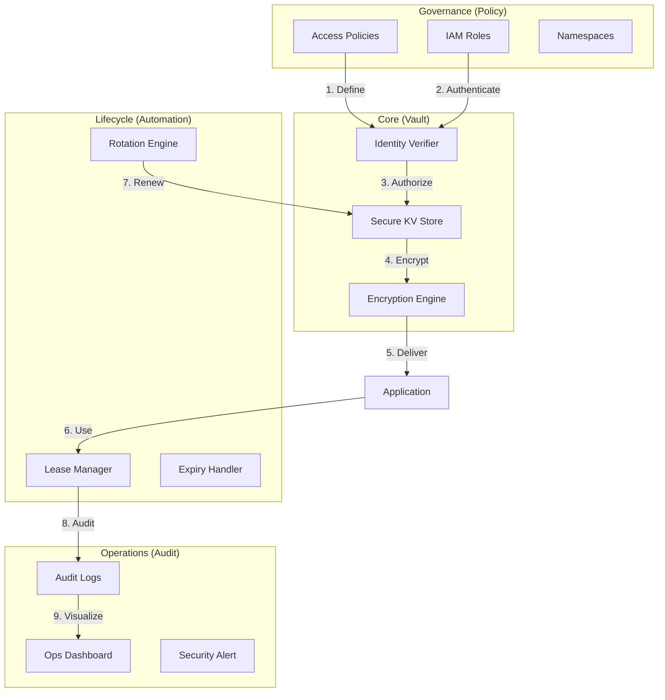

### 2. Multi-Tenant Vault Topology
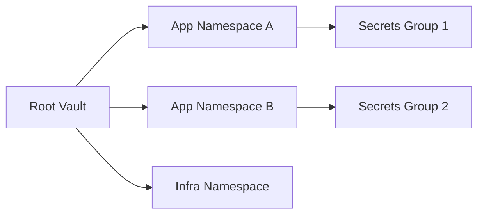

### 3. Secret Rotation Workflow
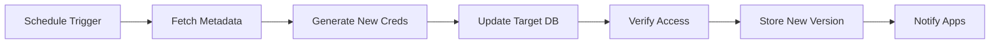

### 4. Vault Central Architecture
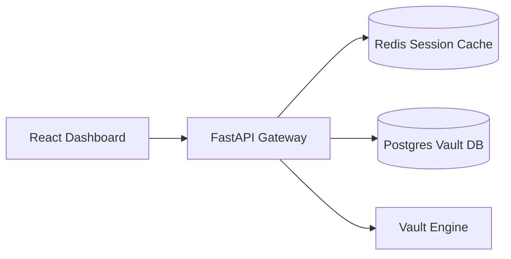

### 5. Deployment Topology: High-Available Vault Hub
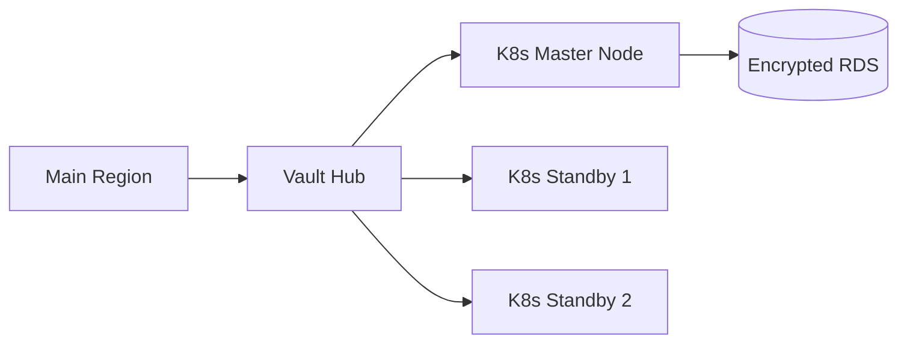

### 6. Identity-Based Access Mapping
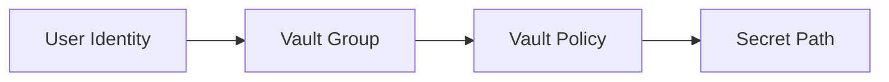

### 7. Foundation: Multi-Environment Setup
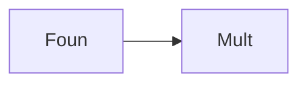

### 8. Security: Master Key Unsealing
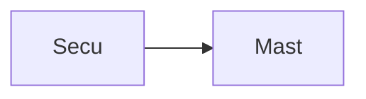

### 9. Component: Vault Engine
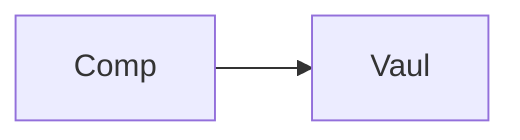

### 10. Component: Policy Engine
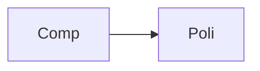

### 11. Component: Rotation Engine
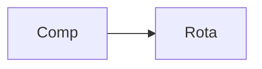

### 12. Component: Integration Hub
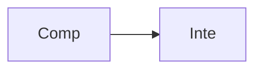

### 13. Logic: AES-like Encryption
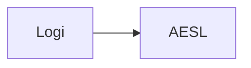

### 14. Logic: Version Rollback
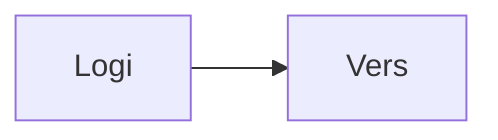

### 15. Logic: Lease Renewal
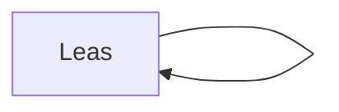

### 16. Logic: Conditional Policy
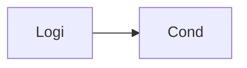

### 17. Architecture: Global Control Plane
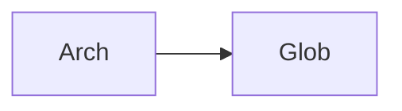

### 18. Architecture: Secret Mesh
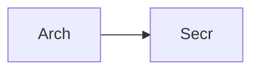

### 19. Architecture: Multi-Sink Auditing
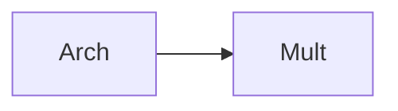

### 20. Pattern: Secrets-as-Code
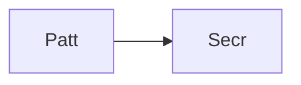

### 21. Pattern: Immutable Audit Trails
```mermaid
graph LR
    P[Patt] --> I[Immu]
```

### 22. Pattern: Automated Recovery
```mermaid
graph LR
    P[Patt] --> A[Auto]
```

### 23. Security: Signed Secret Values
```mermaid
graph LR
    S[Secu] --> S[Sign]
```

### 24. Security: RBAC Namespace Isolation
```mermaid
graph LR
    S[Secu] --> R[RBAC]
```

### 25. Security: Secure Audit Record
```mermaid
graph LR
    S[Secu] --> S[Secu]
```

### 26. Feature: Secret Heatmap UI
```mermaid
graph LR
    F[Feat] --> S[Secr]
```

### 27. Feature: Real-time Audit Tailing
```mermaid
graph LR
    F[Feat] --> R[Real]
```

### 28. Feature: Auto-generated PCAPs
```mermaid
graph LR
    F[Feat] --> A[Auto]
```

### 29. Compliance: SOC2 Secret Audits
```mermaid
graph LR
    C[Comp] --> S[SOC2]
```

### 30. Compliance: Audit Trail Persistence
```mermaid
graph LR
    C[Comp] --> A[Audi]
```

### 31. Infrastructure: Redis Session Cache
```mermaid
graph LR
    I[Infr] --> R[Redi]
```

### 32. Infrastructure: Postgres Secret DB
```mermaid
graph LR
    I[Infr] --> P[Post]
```

### 33. Deployment: Kubernetes Vault Pods
```mermaid
graph LR
    D[Depl] --> K[Kube]
```

### 34. Deployment: Multi-Region Secret Sync
```mermaid
graph LR
    D[Depl] --> M[Mult]
```

### 35. Monitoring: rotation success KPI
```mermaid
graph LR
    M[Moni] --> R[Rota]
```

### 36. Monitoring: access latency KPI
```mermaid
graph LR
    M[Moni] --> A[Acce]
```

### 37. UI: Unified Security Dashboard
```mermaid
graph LR
    U[UI] --> U[Unif]
```

### 38. UI: Policy Hub UI
```mermaid
graph LR
    U[UI] --> P[Poli]
```

### 39. UI: Rotation View
```mermaid
graph LR
    U[UI] --> R[Rota]
```

### 40. UI: Namespace Heatmap
```mermaid
graph LR
    U[UI] --> N[Name]
```

### 41. CI/CD: Policy validation pipeline
```mermaid
graph LR
    C[CICD] --> P[Plan]
```

### 42. CI/CD: Vault engine tests
```mermaid
graph LR
    C[CICD] --> V[Vaul]
```

### 43. Strategy: Security-First Foundation
```mermaid
graph LR
    S[Stra] --> S[Secu]
```

### 44. Strategy: Data-Driven Rotation
```mermaid
graph LR
    S[Stra] --> D[Data]
```

### 45. Feature: Multi-Cloud Secret Bridge
```mermaid
graph LR
    F[Feat] --> M[Mult]
```

### 46. Feature: Real-time Outage Alerts
```mermaid
graph LR
    F[Feat] --> R[Real]
```

### 47. Feature: Threat Forecasting
```mermaid
graph LR
    F[Feat] --> T[Thre]
```

### 48. Logic: Leasing Workflow Engine
```mermaid
graph LR
    L[Logi] --> L[Leas]
```

### 49. Data Model: Secret Version Entity
```mermaid
graph LR
    D[Data] --> S[Secr]
```

### 50. Enterprise Security Excellence
```mermaid
graph LR
    E[Entr] --> S[Secu]
```

---

## 🛠️ Technical Stack & Implementation

### Vault Engine & APIs
- **Framework**: Python 3.11+ / FastAPI.
- **Vault Engine**: Namespace-based secret storage with AES-like encryption.
- **Policy Engine**: RBAC-driven access validation for namespaces and paths.
- **Rotation Engine**: Intelligent orchestration of credential lifecycle workflows.
- **Integration Hub**: Abstraction layer for Kubernetes and CI/CD secret injection.
- **Cache**: Redis for session tracking and real-time lease monitoring.
- **Persistence**: PostgreSQL for encrypted secrets, policy metadata, and audit trails.
- **Observability**: Prometheus/Grafana integration for vault operations.

### Frontend (Security Command Center)
- **Framework**: React 18 / Vite.
- **Theme**: Zinc / Amber (Modern Security & Ops aesthetic).
- **Visualization**: Recharts for access trends and policy compliance distribution.

### Infrastructure
- **Runtime**: AWS EKS (Kubernetes).
- **Deployment**: Helm charts for Vault nodes and rotation workers.
- **IaC**: Terraform (Modular with Security focus).

---

## 🚀 Deployment Guide

### Local Development
```bash
# Clone the repository
git clone https://github.com/devopstrio/vault-central-management.git
cd vault-central-management

# Setup environment
cp .env.example .env

# Launch the Vault stack (API, Engines, DB, Redis, UI)
make up

# Seed initial secrets and policies
make seed

# Validate security architecture
make test
```
Access the Vault Dashboard at `http://localhost:3000`.

---

## 📜 License
Distributed under the MIT License. See `LICENSE` for more information.
