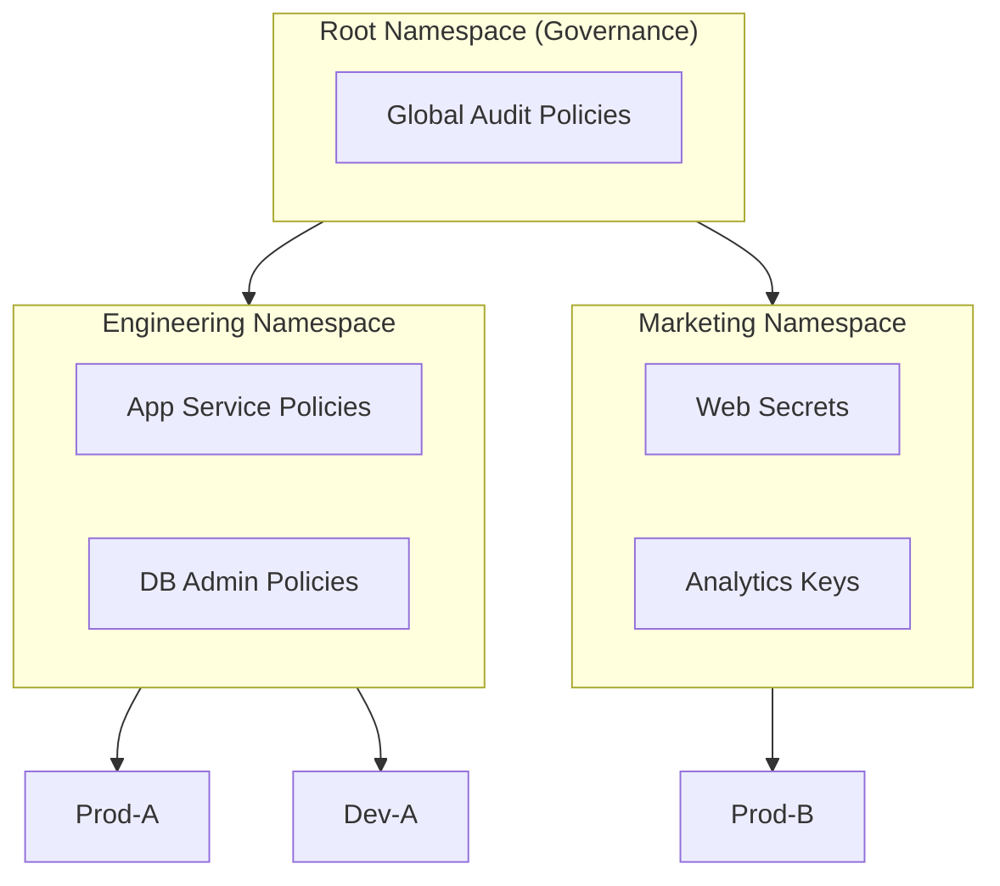
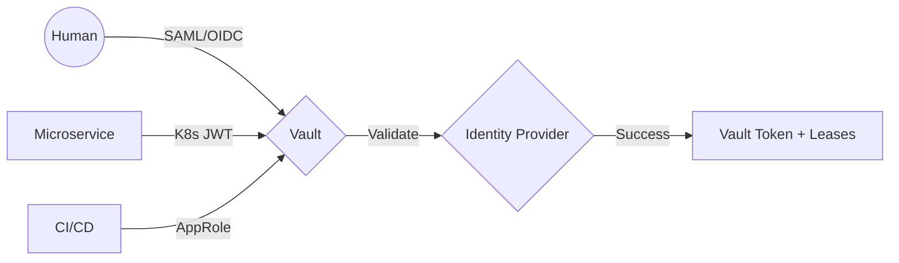
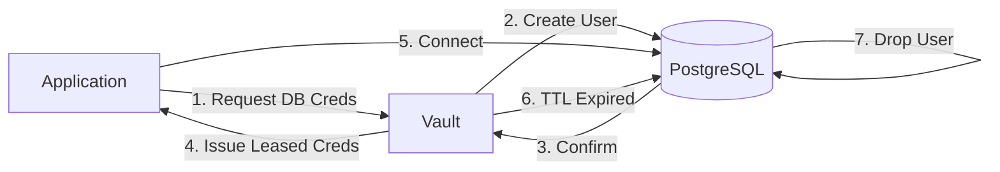
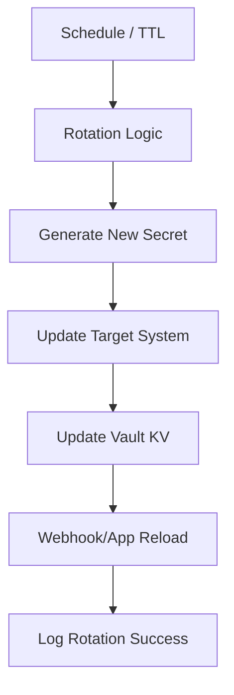
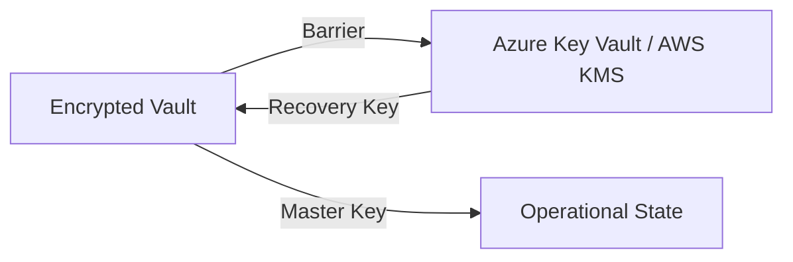
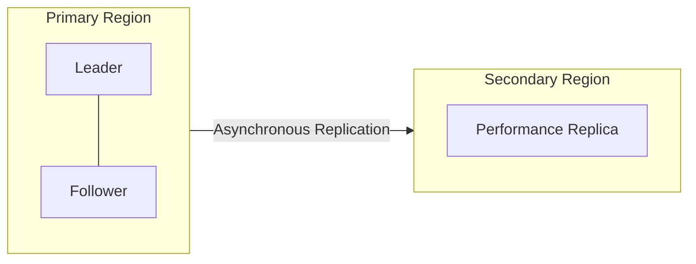
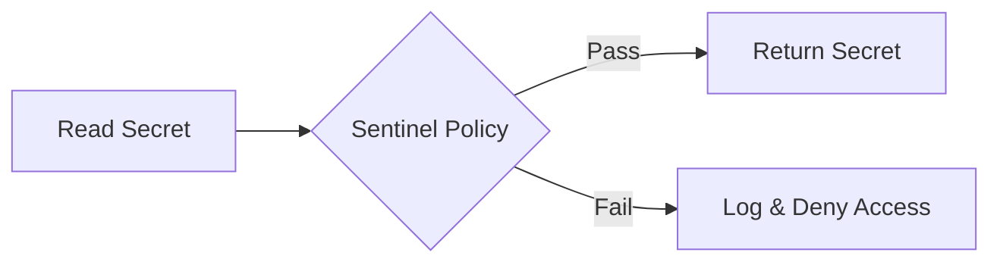
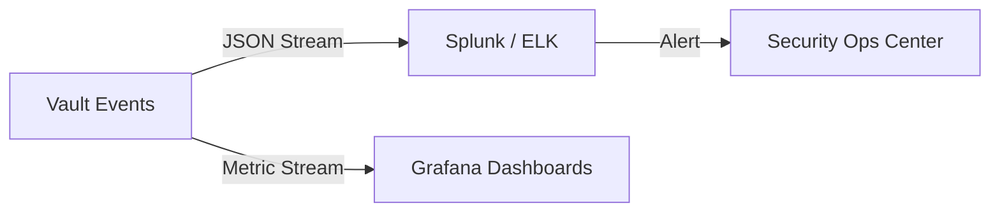

<div align="center">


<h1>Vault Central Management</h1>

<p><strong>The Strategic Foundation for Enterprise Secrets Management, Policy-as-Code Enforcement, and Automated Credential Lifecycle Governance.</strong></p>

[]()
[]()
[]()

<br/>

> **"Identity is the new perimeter; secrets are the new currency."** 
> **Vault Central Management (Central-Vault)** is an institutional-grade platform designed to provide a secure, measurable, and highly automated foundation for global secrets management. It orchestrates the entire lifecycle—from secure encryption-at-rest to dynamic credential generation and real-time policy enforcement.

</div>

---

## 🏛️ Executive Summary

Hardcoded credentials and fragmented secrets management are strategic security liabilities. Organizations often fail to secure their infrastructure not because of a lack of encryption, but because of decentralized secret stores, lack of automated rotation, and an inability to enforce access policies with operational precision.

This platform provides the **Secrets Automation Plane**. It implements a complete **Enterprise Vault-as-Code Framework**, enabling security teams to manage secrets, policies, and identities as primary architectural pillars. By automating the rotation and injection phases, we eliminate hardcoded risks and ensure zero-trust compliance across the global enterprise ecosystem.

---

## 📐 Architecture Storytelling: Principal Reference Models

### 1. Principal Architecture: Global Zero-Trust Secrets Plane
This diagram illustrates the end-to-end flow from multi-factor authentication to secure secret injection into distributed applications.

```mermaid
graph LR
    %% Subgraph Definitions
    subgraph Identity["Identity & Access (Zero Trust)"]
        direction TB
        OIDC[OIDC / Okta / Azure AD]
        K8sAuth[Kubernetes Auth Method]
        Token[AppRole / Vault Tokens]
    end

    subgraph IntelligencePlane["Vault Central Intelligence Plane"]
        direction TB
        API[FastAPI Management Gateway]
        Policy[Policy Engine (Sentinel)]
        Namespace[Namespace Manager]
        Audit[Audit & Compliance Hub]
    end

    subgraph CoreVault["Enterprise Vault Cluster"]
        direction TB
        KV[KV Secrets Engine]
        Transit[Transit Encryption]
        PKI[Dynamic PKI Engine]
        DBMethod[Dynamic Database Secrets]
    end

    subgraph Connectivity["Secure Connectivity & Edge"]
        direction TB
        LB[Load Balancer / Ingress]
        PE[Private Endpoints]
        Seal[Auto-Unseal (KMS/HSM)]
    end

    subgraph TargetApps["Consumer Workloads"]
        direction TB
        Sidecar[Vault Sidecar Agent]
        CSI[Secrets Store CSI]
        CICD[CI/CD Runners]
    end

    subgraph DevOps["DevOps & Governance"]
        direction TB
        GH[GitHub Actions]
        TF[Terraform Vault Provider]
        Monitor[Prometheus / Grafana]
    end

    %% Flow Arrows
    Users((Security Admins)) -->|1. Authenticate| OIDC
    OIDC -->|2. Issue Token| API
    API -->|3. Configure| Namespace
    Namespace -->|4. Apply Policy| Policy
    
    GH -->|5. Provision| TF
    TF -->|6. Manage| CoreVault
    
    TargetApps -->|7. Auth| K8sAuth
    K8sAuth -->|8. Verify| CoreVault
    CoreVault -->|9. Inject| Sidecar
    Sidecar -->|10. Consume| TargetApps
    
    CoreVault -->|Telemetery| Monitor
    CoreVault -->|Audit Logs| Audit
    Seal -->|Unseal| CoreVault

    %% Styling
    classDef identity fill:#e1f5fe,stroke:#01579b,stroke-width:2px;
    classDef intel fill:#ede7f6,stroke:#311b92,stroke-width:2px;
    classDef core fill:#e8f5e9,stroke:#1b5e20,stroke-width:2px;
    classDef connect fill:#fff3e0,stroke:#e65100,stroke-width:2px;
    classDef target fill:#f5f5f5,stroke:#616161,stroke-width:2px;
    classDef devops fill:#fffde7,stroke:#f57f17,stroke-width:2px;

    class Identity identity;
    class IntelligencePlane intel;
    class CoreVault core;
    class Connectivity connect;
    class TargetApps target;
    class DevOps devops;
```

### 2. Multi-Tenancy: Namespace & Policy Hierarchy
The architectural structure for isolating secrets across departments and environments.



### 3. Identity Flow: Multi-Method Authentication
How various identities (Human & Machine) obtain a Vault session.



### 4. Secret Injection Lifecycle: Sidecar vs. Agent
Modern patterns for delivering secrets to applications without hardcoding.

```mermaid
graph LR
    subgraph Pod["Kubernetes Pod"]
        App[Main Application]
        Agent[Vault Agent Sidecar]
    end

    subgraph Server["Vault Cluster"]
        KV[KV Secrets]
    end

    Agent -->|1. Auth| Server
    Server -->|2. Token| Agent
    Agent -->|3. Fetch| KV
    KV -->|4. Secret| Agent
    Agent -->|5. Render| File[/vault/secrets/config]
    App -->|6. Read| File
```

### 5. Dynamic Secrets: Just-In-Time Database Credentials
The flow for generating ephemeral database accounts that automatically expire.



### 6. Automated Secret Rotation Pipeline
The background lifecycle of a managed credential.



### 7. Seal/Unseal Architecture: Cloud KMS Auto-Unseal
Ensuring Vault remains secure at rest while enabling high-availability recovery.



### 8. High Availability: Cluster Replication Topology
Disaster recovery and performance replication across global regions.



### 9. Policy-as-Code: Sentinel Enforcement Loop
Enforcing security standards (e.g., no secrets in plain text, CIDR restrictions).



### 10. Audit & Compliance Reporting Flow
The pipeline for forensic analysis and real-time security alerts.



---

## 🏛️ Core Platform Pillars

1.  **Centralized Vault Engine**: High-performance abstraction layer with multi-tenant namespace isolation.
2.  **Encryption-as-Code**: Carrier-grade engine for AES-256 GCM encryption/decryption of sensitive data.
3.  **Automated Rotation Engine**: Intelligent orchestration of scheduled rotations for Databases, SSH keys, and Cloud APIs.
4.  **Identity-Based Access Control**: Zero-trust enforcement of granular RBAC policies.
5.  **Dynamic Secrets Hub**: Real-time generation of short-lived, leased credentials.
6.  **Unified Audit & Governance**: Deep observability into secret access patterns and policy compliance.

---

## 🛠️ Technical Stack & Implementation

### Platform Engine & APIs
*   **Framework**: Python 3.11+ / FastAPI.
*   **Identity Services**: Integration with OIDC, Kubernetes Auth, and AppRole.
*   **State Management**: PostgreSQL (Metadata) and Redis (Lease Cache).
*   **Observability**: Prometheus/Grafana integration for security metrics.

### Frontend (Security Command Center)
*   **Framework**: React 18 / Vite.
*   **Theme**: Zinc / Amber (Modern Security & Ops aesthetic).
*   **Visualization**: Recharts for access trends and compliance scoring.

### Infrastructure
*   **Runtime**: AWS EKS or Azure Kubernetes Service (AKS).
*   **IaC**: Modular Terraform for Vault and Cloud KMS provisioning.

---

## 🏗️ IaC Mapping (Module Structure)

| Module | Purpose | Real Services |
| :--- | :--- | :--- |
| **`infrastructure/vault`** | Core cluster and storage | EKS, EBS, DynamoDB |
| **`infrastructure/security`** | Trust and Seal mechanisms | AWS KMS, Azure Key Vault |
| **`infrastructure/identities`** | Auth methods and policies | Entra ID, Okta, IAM |
| **`infrastructure/monitoring`** | Audit and observability | Prometheus, Splunk |

---

## 🚀 Deployment Guide

### Local Principal Environment
```bash
# Clone the repository
git clone https://github.com/devopstrio/vault-central-management.git
cd vault-central-management

# Setup environment
cp .env.example .env

# Launch the Vault stack
make up

# Seed initial namespaces and policies
make seed

# Run the security validation suite
make test
```

Access the Vault Dashboard at `http://localhost:3000`.

---

## 📜 License
Distributed under the MIT License. See `LICENSE` for more information.

---
<div align="center">
  <p>© 2026 Devopstrio. All rights reserved.</p>
</div>
